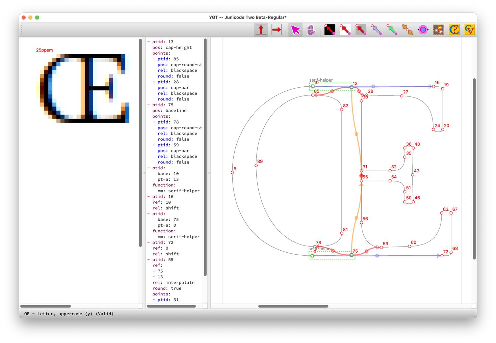
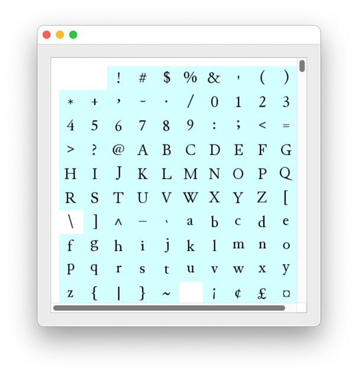
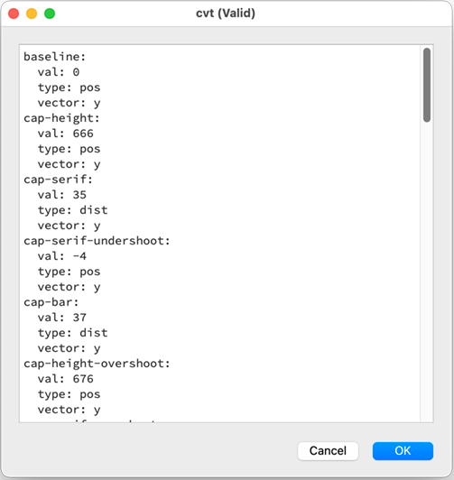

# ygt
Ygt is a cross-platform graphical hinting program for TrueType fonts. There are already several hinting tools for TrueType: the hinter built into Glyphs; the one built into FontLab; VTT (Visual TrueType), a stand-alone editor from Microsoft; and probably several more. These are all very good, but all have disadvantages. The Glyphs editor won't work for you unless you have purchased Glyphs and use it to export fonts (if you use Glyphslib/fontmake, you're out of luck; in addition, Glyphs only runs on the Mac. I know little about the FontLab hint editor, but (obviously) you must purchase FontLab to get access to it. VTT is a sophisticated tool, and it is free, but its GUI is awkward and old fashioned. It is built on top of a poorly documented language called VTT Talk, and it runs only on Microsoft Windows. The program is rather a busybody (in my experience, anyway), repositioning the components of composite glyphs, and sometimes doing considerable damage (and because of the poor documentation, this damage is hard to undo).

Ygt is a cross-platform program, written in Python with PyQt6. It is entirely Libre/Open Source, and it doesn't depend on any font editor (all of its dependencies are also free). It is less sophisticated than some existing tools, but in this respect is is well suited for the contemporary font scene, in which hinting does not need to be as complex as it formerly was. It is built for speed, with all of the most common actions on shortcut keys, so that you can work quickly with one hand on the mouse and the other on the keyboard. Hints are saved in an easily edited YAML file, the format of which will be thoroughly documented.

Other hinting programs dump a large number of functions into your font. Ygt dumps only a few, but it encourages you to write your own functions and macros, and it provides a graphical interface for managing them. Functions are named rather than numbered. Control values are also named, and points and sets of points can be named too: you select them by name from context menus.

Ygt is in an alpha state, with features yet to be added and some (mostly minor) issues. Deficits and items on the to-do list:

- There is no auto-hinting (but when did you ever see an auto-hinted glyph that didn't require extra attention?).
- YAML source is not yet validated.
- The arrows are ugly (it will take actual mathematics to fix them), as are some other elements of the GUI.
- The editing pane lacks a grid, as does the separate preview pane.
- The preview pane cannot yet display a pixmap as hinted in Microsoft Windows. Instead it uses FreeType, and it is inefficient (which is not, I should add, FreeType's fault).
- Several routines are inefficient, or just poorly written. I am not a professional programmer.

That said, I have used ygt to hint over 1100 glyphs in a large font, sometimes hinting nearly 100 glyphs in an hour. The code it produces is compact: those 1100 sets of hints add about 35k to the size of a 2.2MB font.

The screenshot below illustrates the use of functions or macros (green boxes), primary moves of single points (red arrows), subsidiary moves or shifts (blue arrows), and interpolations (paired yellow arrows). In addition to the large editing pane, it shows the editable YAML source (in the center) and the preview pane (on the left).

You will generally want to keep the font view window open alongside the main window:

In this window, glyphs that are already hinted are highlighted in blue, and you can navigate to any glyph by clicking on its image. YAML source for functions, macros, the cvt table, and the cvar table (for variable fonts) can be edited in other windows:

Graphical methods for editing some or most of these will be added eventually.

This project may be too big for one person. I invite anyone with an interest in TrueType hinting and some knowledge of one or more of ygt’s major dependencies (PyQt6, fontTools, and FreeType) to contribute by adding features, fixing bugs, or cleaning up my amateurish Python code. All contributors will be credited.
