# Ygt

**Ygt** is a Python app for hinting TrueType fonts. It is built to be fast, flexible, and free:

- it will run equally well under Windows, Mac OS, and Linux;
- it emphasizes modern requirements for TrueType hinting while deemphasizing the obsolete;
- the most common commands use unmodified shortcut keys so you can work quickly with one hand on the keyboard and one on the mouse;
- it will read either a TrueType font or a UFO;
- it saves hints in an easily understood and edited YAML file,
- which can be compiled to a hinted font either from inside the program or from the command line,
- or it can save compiled hints to a UFO (from which fontmake can produce a hinted font)

Ygt is in an alpha state, with features yet to be added (especially auto-hinting). But it is already a workable program, which the developer has used to hint thousands of glyphs in several large fonts.

Several executable files are available in the “Releases” section of the Ygt GitHub site. If none of these are suitable for your system, Ygt must be launched from a command line. In this case, install from an environment where the version of Python is 3.10.4 or later by typing `pip install ygt` on the command line. Alternatively, download the files from GitHub, navigate to the directory with the file pyproject.toml, and type `pip install .` (don't forget the period!). Then type `ygt <Return>` to start the program.

To get started, go through the following brief tutotial. More detailed information is in the file 
For more information, see the [YGT-Intro.pdf](https://github.com/psb1558/ygt/tree/main/docs).

Tutorial for the ygt hint editor
================================

This tutorial assumes that you understand what TrueType hinting is and what it is for. It also assumes that you have succeeded in downloading and launching ygt. If the first of these things is not true, read the [introduction to TrueType hinting](https://learn.microsoft.com/en-us/typography/truetype/hinting) at the Microsoft Typography site. If the second is not true, consult the “Getting Started” section of the document [YGT-Intro.pdf](https://github.com/psb1558/ygt/blob/main/docs/YGT-intro.pdf).

The ygt window
--------------

Start a hinting project by launching ygt and opening either a TrueType font or a UFO. For this tutorial we’ll open the variable version of the [Elstob font](https://github.com/psb1558/Elstob-font) (the very font in which this document is set), which will enable us to demonstrate both basic hinting techniques and advanced techniques relating to variable fonts.

When you first load a font, the ygt main window looks like this:

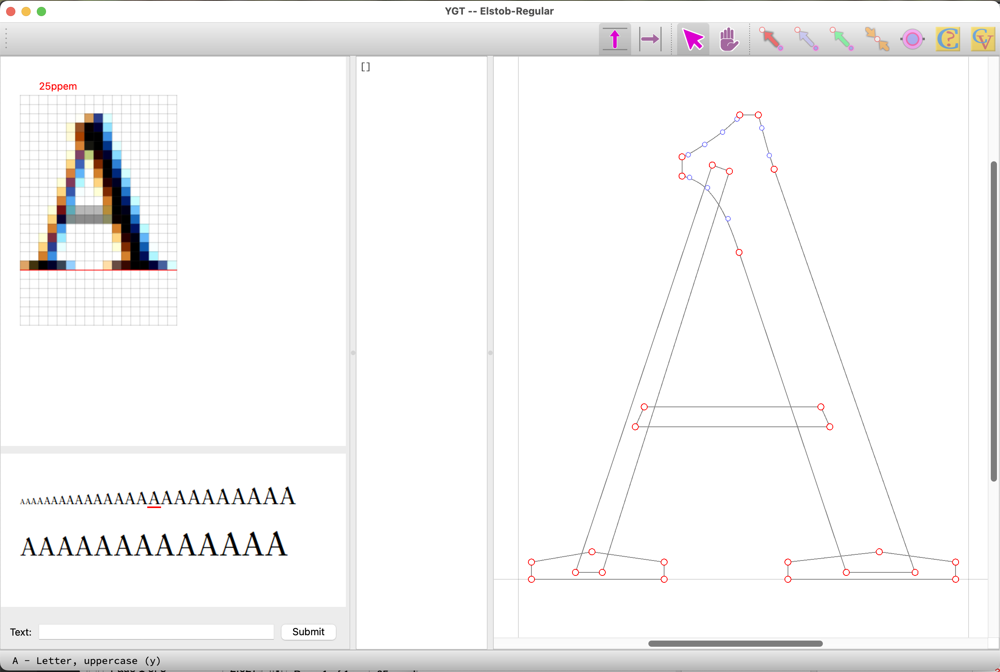

This window is divided into five panes. On the right is the graphical editor, where you will do most of your work. In the middle is the code pane. ygt stores hints and other data in files in the YAML serialization language, and the code pane displays this YAML code. You can edit the code directly, though most of the time it will be faster and easier to use the graphical editor.\* \*You can find a reference for ygt’s very simple hinting language in the document [YGT-Intro.pdf](https://github.com/psb1558/ygt/blob/main/docs/YGT-intro.pdf). On the left are two preview panes. The one on the top shows a blown-up version of the current glyph as it will be rendered on screen, with the current collection of hints applied. You can view this glyph at various resolutions (in pixels per inch) and in various rendering modes, and you can view it in black-on-white or white-on-black. If you are hinting a variable font, you can preview any instance. All of these choices can be made from the “Preview” menu.

Beneath the big preview pane is one that by default shows the current glyph in an array of resolutions beginning with 10ppem:

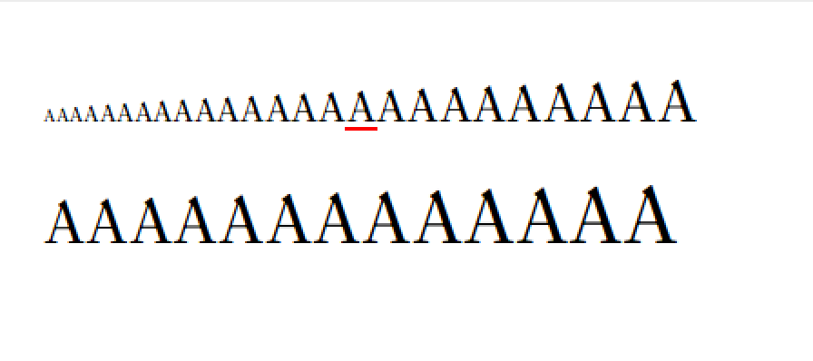

The current resolution (25ppem is the default) is underlined in red; click on any instance to display that resolution in the large pane above. If you want to see a glyph in context, type something (perhaps a favorite pangram) into the “Text” box and hit the Enter key or click “Submit”: the text will appear in the current resolution and in the current instance:

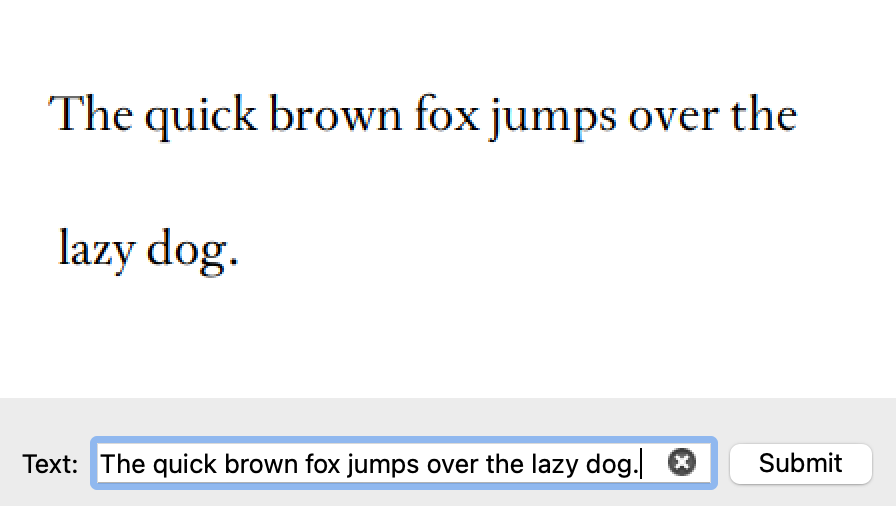

By choosing options on the “Preview” menu, you can choose the script and language for this text, and you can apply any of your font’s OpenType features—for example, small caps:

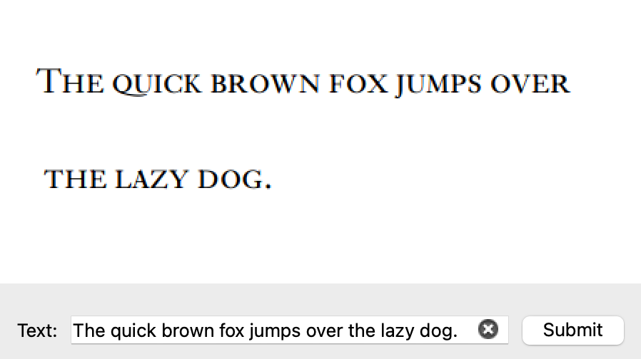

The ability to apply scripts, languages, and features enables you to get a preview of any glyph in context.

At the top of the ygt window is a row of buttons. Some of these are for adding hints (more on these later), while others are for managing CVs, changing the behavior of the pointer, and choosing the hinting direction (though modern fonts are usually hinted only on the y axis).

There are two more important windows to mention before we go on. One is the “Font Viewer,” which displays all the glyphs of the font:

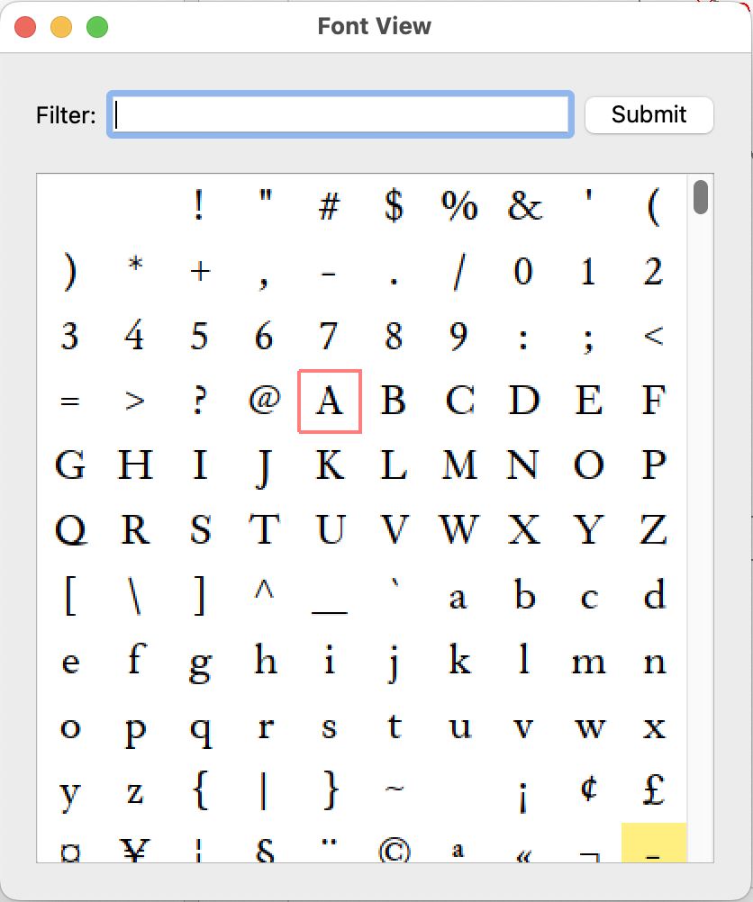

You can filter the display by typing any part of a glyph name. For example, typing “eight” in the “Filter” box causes the Font Viewer to display all variants of the number eight:

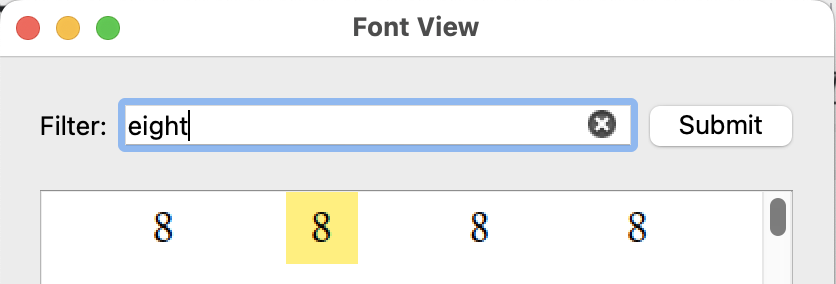

Glyphs that are already hinted are highlighted in blue; composite glyphs (which can’t be edited in ygt) are highlighted in gold. The current glyph is outlined in red.

Go to any glyph by clicking on it in the Font Viewer.

Next is the “Font Info” window:

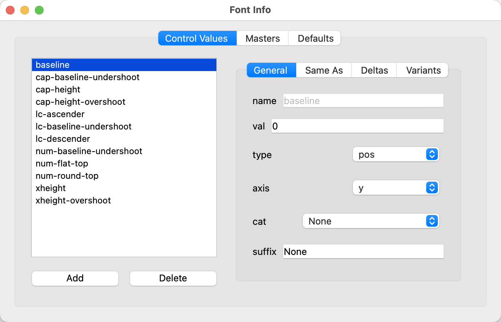

This allows you to manage all of the font’s control values (CVs),\* \*A control value is an integer stored in an array in the font. It is used by anchor and stem hints to position points on the grid and regulate distances. which in ygt are named rather than numbered. Here you can also manage the masters of variable fonts, which correspond to the masters you produced when designing the font, and the variant CVs associated with those masters. We’ll have much more to say about managing CVs later on in this tutorial.

You can also manage defaults for the current font on the “Defaults” tab of the Font Info window.

Setting up for hinting
----------------------

Before we start to hint this font, we should customize the workspace. By default, the graphical editor shows all of a glyph’s points: on-curve points are red circles, and off-curve points are slightly smaller blue circles. It is quite possible to apply hints to off-curve points, but I strongly suggest that you hint only on-curve points. If you decide to follow this advice, you can suppress the display of off-curve points by right-clicking anywhere in the graphical editor and selecting “Hide off-curve points” from the context menu.

It normally isn’t necessary to display point labels while editing, but if you want them for any reason, select “Show point labels” from the context menu:

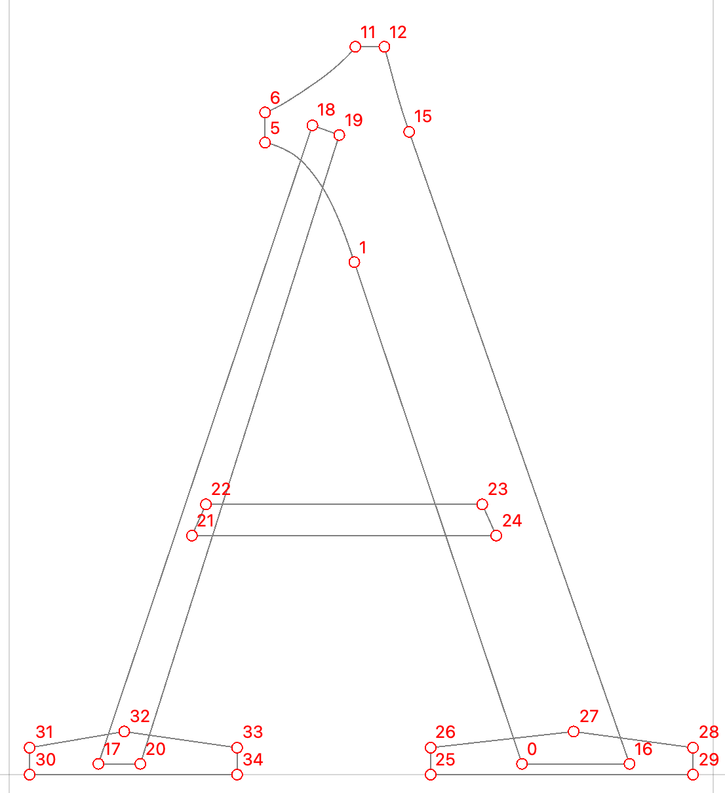

In a TrueType font, glyph outlines are defined by a zero-based array of points. Most TrueType hint editors require that you refer to points using indexes into this array. Unfortunately, these point numbers are unstable. If you switch font editors, the new editor will probably number points differently. If you make even minor edits in a glyph, you will very likely cause the glyph’s points to be renumbered. If you do either of these things after you’ve begun hinting, the result will be chaos.

One way around this problem is to display point labels as coordinates rather than indexes. Select “On-curve labels as coordinates” from the context menu to switch to this mode:

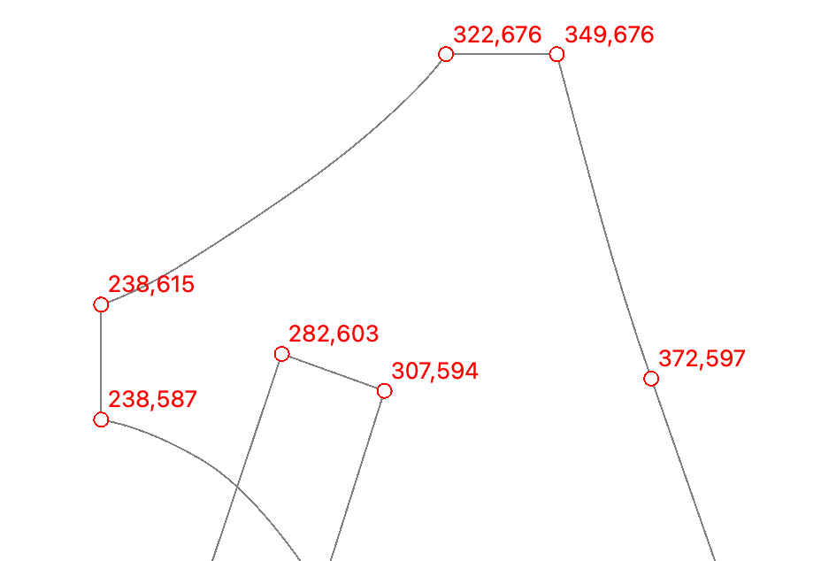

Now the code generated by ygt will refer to points by their coordinates rather than their indexes, and ygt will translate these coordinates into indexes at compile time. Since font apps will not move on-curve points even if you add points, move off-curve points, or change editors, coordinates can be more stable than indexes. If you switch the display from indexes to coordinates and then hide point labels, coordinates will still be inserted in your code.

Neither coordinates nor indexes are particularly mnemonic, but you can name points if you like. If you name just a few key points, they will make it easy to spot the sections of your code dealing with the various features of a glyph.

To name a point, select\* \*To select a point, click or drag over it. Selected points are filled with gray. it, right click in the graphical editor, and select “Name selected point” from the context menu. Type a name in the dialog that appears. The name will show in the graphical editor:

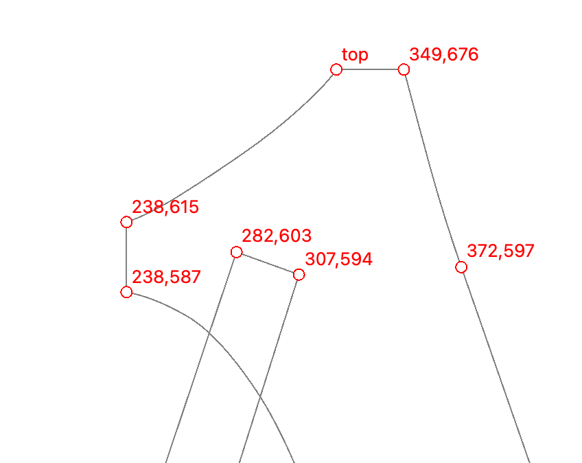

If you name a point while point labels are displayed as indexes, the name will serve as an alias for an index; otherwise it will serve as an alias for a coordinate-pair.

ygt does a good bit of setup for you the first time you open a font. It analyzes the font and builds a short list of CVs, each of which is accompanied by a good bit of information, as you can see in the entry for “xheight”:

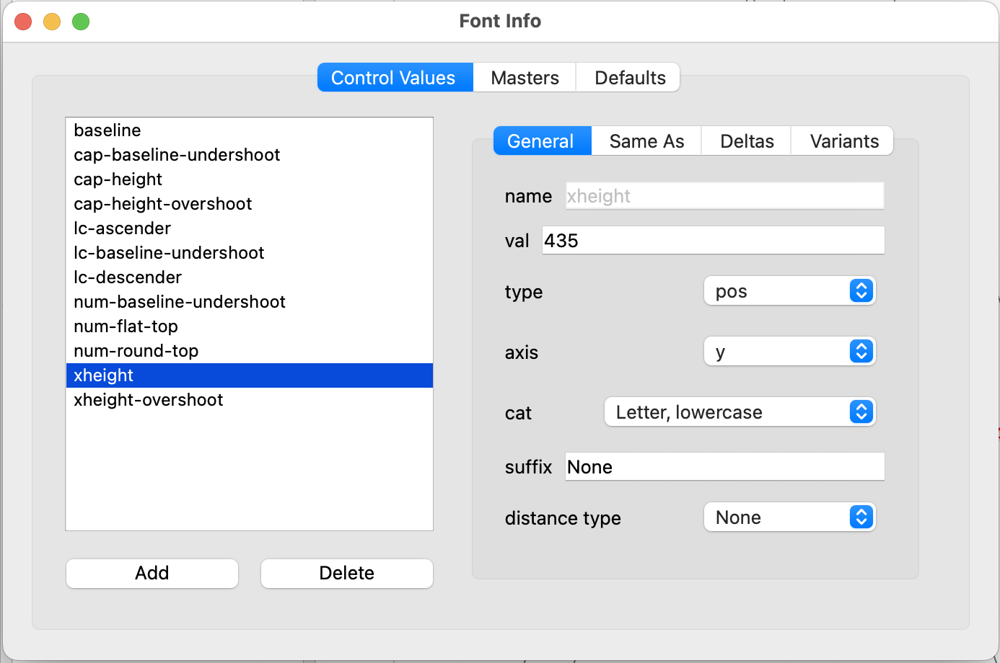

name

ygt names CVs rather than requiring that you memorize their indexes. You supply a name when you create a CV, but the name can’t be changed afterwards—except by editing the code.

val

A number in font units. For CVs of this type (see next item), this value is an absolute position on the current axis.

type

This can be “pos” (for “position”) or “dist” (for distance). A “pos” CV is an absolute position of a point on the grid, while a “dist” CV is the distance between two points.

axis

This can be “x” or “y.” Hinting for most fonts is now done only on the y axis.

cat

The category of character that this CV applies to.\*Unencoded glyphs have no Unicode category, but ygt can usually guess at one. All of the encoded glyphs in a font belong to a Unicode category (e.g. “Letter, uppercase” or “Symbol, currency”).\* Selecting a category here signals that this CV applies only to characters in that category.

suffix

Some classes of characters do not correspond to the Unicode categories, but can be identified by suffixes (like .sc or .smcp for small caps). If you enter a value here, this CV will apply only to characters with the specified suffix.

A CV can be made equal to another CV at specified sizes. For an example, select “xheight-overshoot” in the list of CVs and click over to the “Same as” tab:

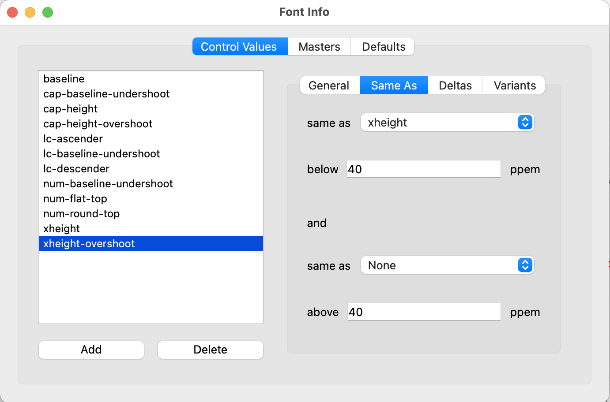

Here the CV “xheight-overshoot” is made equal to the “xheight” CV when the current resolution is less than 40ppem. (The same can be done when the current resolution is above a certain value, but this will be rarer.) The normal use of this feature is to equalize approximately equal CVs at low resolutions, so that, for example, characters with overshoot (like o) don’t appear too much higher or lower than characters without overshoot (like x). In this example (at 18ppem), the top line does not set the two CVs equal and the bottom line does:

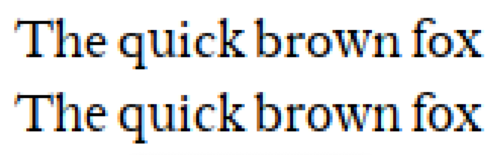

By default, the two CVs specified here are set equal below 40ppem, but you should experiment with this threshold number to get the best result for each pair of CVs.

The first time you open a variable font, ygt builds a list of masters. These will usually match the masters you created when designing the font, but you can add to, subtract from, and edit this list:

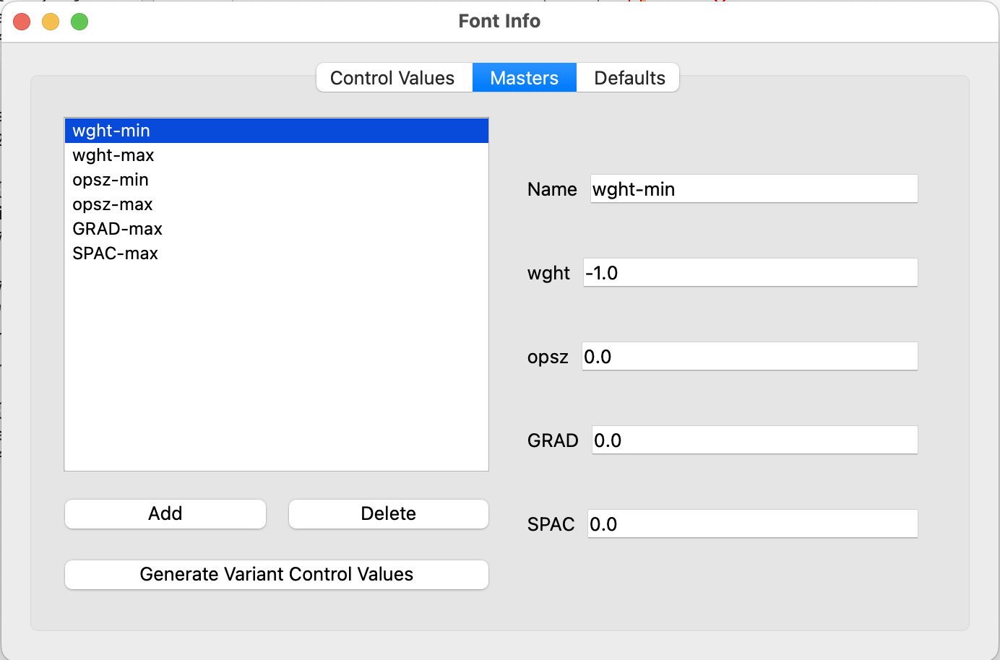

It is beyond the scope of this tutorial to explain the numbers that define each master, but you need to know that each master can have variant CVs associated with it. Notice also the “Generate Variant Control Values” button: we will return later to the subject of variant CVs and of this button. You can see the variant CVs associated with a variable font’s masters on the “Variants” pane of the “Control Values” tab:

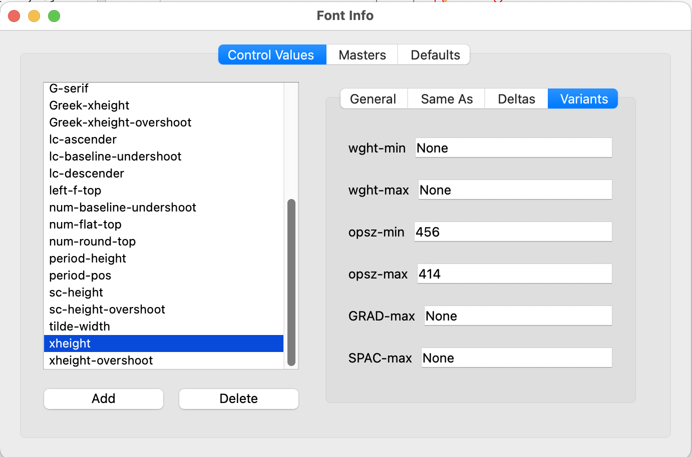

The default value of the “xheight” CV is 435, and it is the same for all the masters for which the value is “None.” But the masters “opsz-min” and “opsz-max” (for “Minimum Optical Size” and “Maximum Optical Size”) have different values for this CV, which rendering engines will interpolate whenever the Optical Size changes.

We will discuss the “Deltas” pane in another tutorial.

Hinting the letter A
--------------------

The operation of the graphical editor will be intuitive to anyone who has used a font or vector editor. To add a hint, select one or more points and click one of these buttons (or use a shortcut key):

*   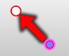 Stem hint (shortcut **T**). This type of hint regulates the distance between a reference and a target point. By default, the distance is rounded: if the reference point is aligned to the grid, the target point will also be aligned to the grid. Also by default, a minimum distance of one pixel is maintained between the reference and the target point. This can be turned off; or a distance of less or more than one pixel can be specified in the code. For precise control, a stem hint can use a CV; but this is not usually necessary in modern hinting.
*   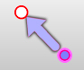 Shift hint (**H**). This moves one or more target points by exactly as much as a reference point has been moved. If rounding is on for this hint, all target points will then (after initial positioning) be rounded to the grid.
*   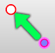 Align hint (**L**). This moves one or more target points so that they are aligned on the current axis with a reference point. If rounding is on for this hint, all target points will then be aligned to the grid. Align hints are generally less useful than the others.
*    Interpolate hint (**I**). This moves one or more target points so that their position relative to two reference points is proportionally the same as in the original glyph. As with the shift and align hints, rounding (if requested) is done after the target points are moved.
*   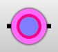 Anchor hint (**A**). This moves a point to a specific position on the grid. The position may be specified with a CV; if not, the point’s destination is its current position. By default, the point’s position is rounded so that it will always land on a grid line. If neither a CV nor rounding is applied, the point is merely “touched”—that is, marked as having been affected by a hint. Being touched protects the point from being inadvertently moved by later instructions.

Let’s start hinting at the bottom of the glyph.\*If a point is both rounded and selected, the fill is dark pink (or a pink-tinted gray). You must always begin a sequence of hints with an anchor hint. Select the bottom-left point (which we named “bottom” earlier) by clicking on it or dragging over it, and click the “Anchor hint” button or type **A**. The point will be highlighted in pink and filled with a lighter pink. The pink highlighting tells us that an anchor hint has been applied to this point, and the light pink fill tells us that the hint is rounded.\*

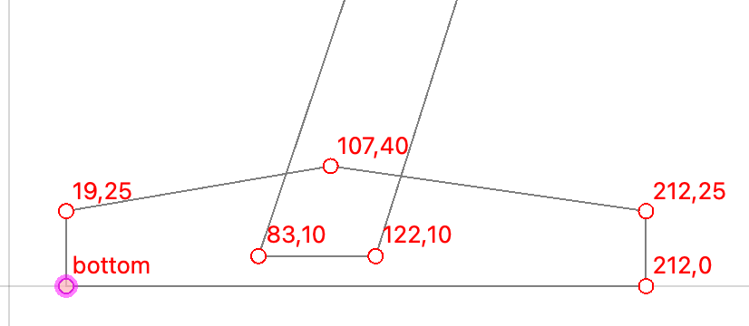

We should apply a CV to this hint: it is not strictly necessary here, but it’s a good idea to use CVs for hints that position points at specific places on the grid, if only for the sake of your code’s legibility. Right click on the “bottom” point, select “Set control value” from the context menu, and choose “baseline” from the list of CVs (only CVs that can be applied to this hint in this glyph appear on the menu):

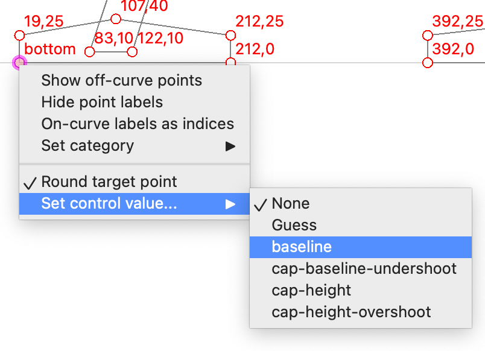

In the code pane, these lines have appeared. Together they make up a hint instruction:

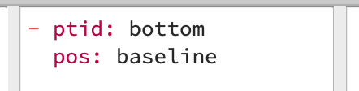

Those who know the YAML language will recognize the hyphen as marking this instruction as a list item (a glyph program is a list of top-level hints with their dependent hints): it consists of two key-value pairs. “ptid” stands for “point identifier”: it can be a single point or a list of points. “pos” stands for “position”: it identifies its value as a position-type CV. If the point were not already positioned on the baseline (if, for example, another instruction caused it to be nudged away), the “baseline” CV would cause it to be moved there.

Most hint instructions in the code pane will also contain a “rel” key, which specifies how the target point or points are to be positioned relative to the reference point or points. Since an anchor hint is not positioned relative to any other point, the “rel” key is omitted here.

Next we should regulate the thickness of the serif.\*A highlighted point like this one can’t be selected by clicking on it: that selects the hint that has been applied to it. Instead, drag over the point to select it. In the days of CRT displays, we used a rounded stem hint with CV for this, but when working on a font for a modern display, it is better to use an unrounded stem hint without a CV. To do this, select the “bottom” point\* and point 19,25, and click the “Stem hint” button or type the shortcut **T**:

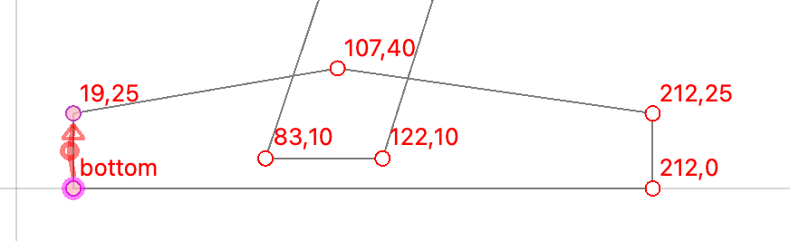

The stem hint is marked with a red arrow running from the reference point “bottom” to the point at coordinates 19,25. You can see from the pink fill for point 19,25 that this hint is rounded: to unround it, right-click on the hint (the button in the middle of the arrow’s stem provides a convenient thing to click on). On the context menu, you will see that the item “Round target point” is checked: select this to unround it.

The hints we have applied so far make little visible difference to the rendered glyph—at least not at 25ppem. If you look closely, you can see that the left serif has become a little darker:

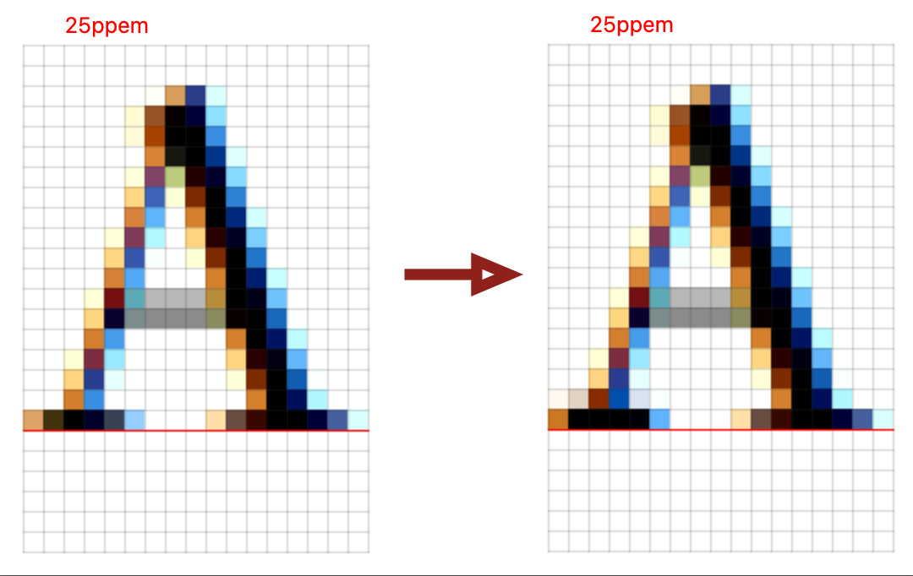

The hinting will make a bigger difference at other resolutions. We need to hint the right-hand serif to match the one on the left. We could apply the same hints we used for the left-hand serif to the one on the right, but it is better to use shift hints here. Select a hinted point on the left and an equivalent point on the right and click the shift-hint button or type the shortcut **H**. Do this for each of the hinted points:

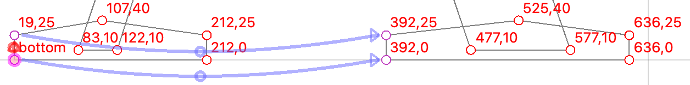

Now let’s hint the top of the letter. For the “top” point we’ll need an anchor hint with CV. It is not necessary to add the hint and the CV with separate operations; instead, hold down the Control or Command key while adding the hint to make ygt guess at the correct CV by choosing the CV with a position closest to that of the target point. (You can make ygt guess at a CV for an existing hint by clicking the “Guess Control Value” button (yellow with a question mark in a C), by typing a question mark as a shortcut key, or by selecting “Guess” from the list of CVs on the context menu.)

With a single action, we have anchored the point “top” and applied the “cap-height-overshoot” CV (since the A is a little higher than most other capitals). We should also regulate the position of the left-hand diagonal relative to the “top” point. To do this, connect “top” with one of the points at the top of the diagonal with a shift-hint:

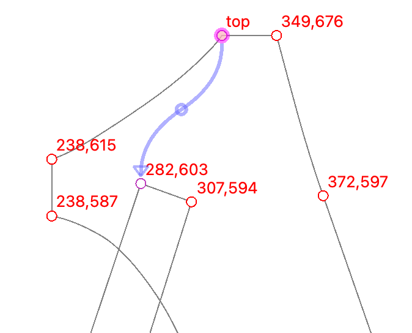

But our hinting of the top of the A has caused a problem at the bottom, where (at certain resolutions) the ends of the diagonals have been pushed out beyond the bottom of the letter:

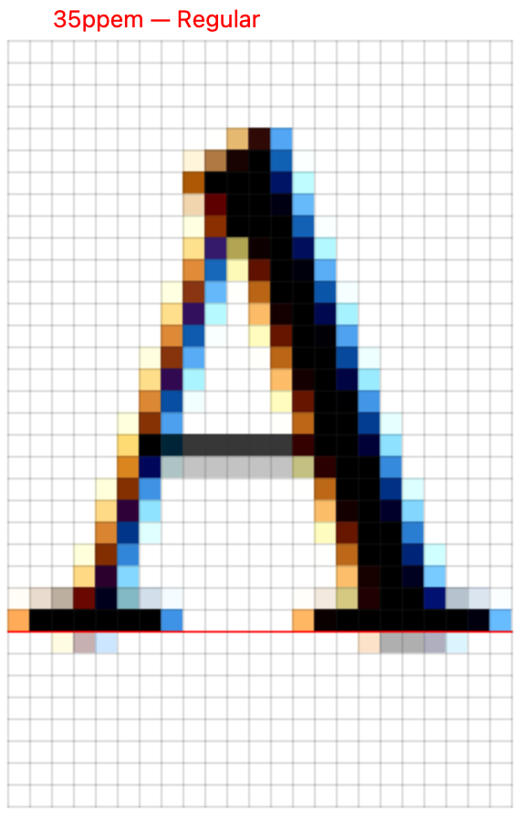

To fix this, we need to regulate the bottoms of the diagonals. There is more than one way to do this; I suggest using an interpolate-hint to force the relevant points back to their original mid-serif positions. Select the two points we hinted in the bottom-left serifs, then one point at the bottom of each diagonal; then click the “Interpolate-hint” button or type **I**:

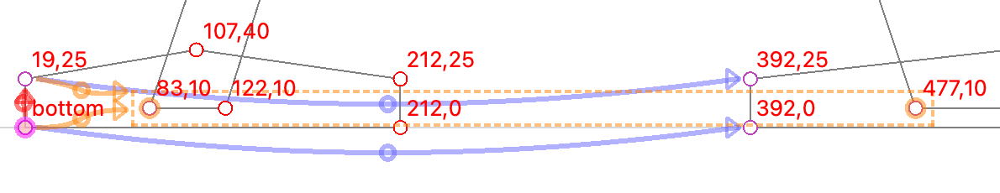

It’s getting a little crowded at the bottom of the glyph, but you can see that yellow arrows now run from the two points we hinted at the beginning of this process to a box containing two points highlighted in yellow. The box identifies the two points as a set: the interpolate-hint operates on all the members of this set. Now the problem with the diagonals is fixed:

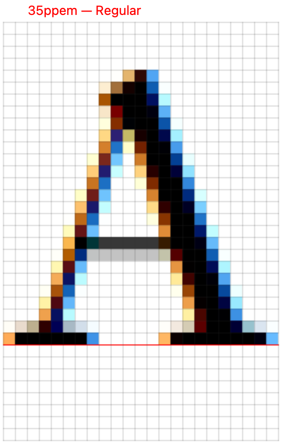

We still need to hint the bar of the A. Select the “top” and “bottom” points, then the “bar” point, and hold down the shift key while clicking the “interpolate-hint” button or typing **I**: the “bar” point (the bottom-left point in the bar) will be interpolated and rounded to the grid:

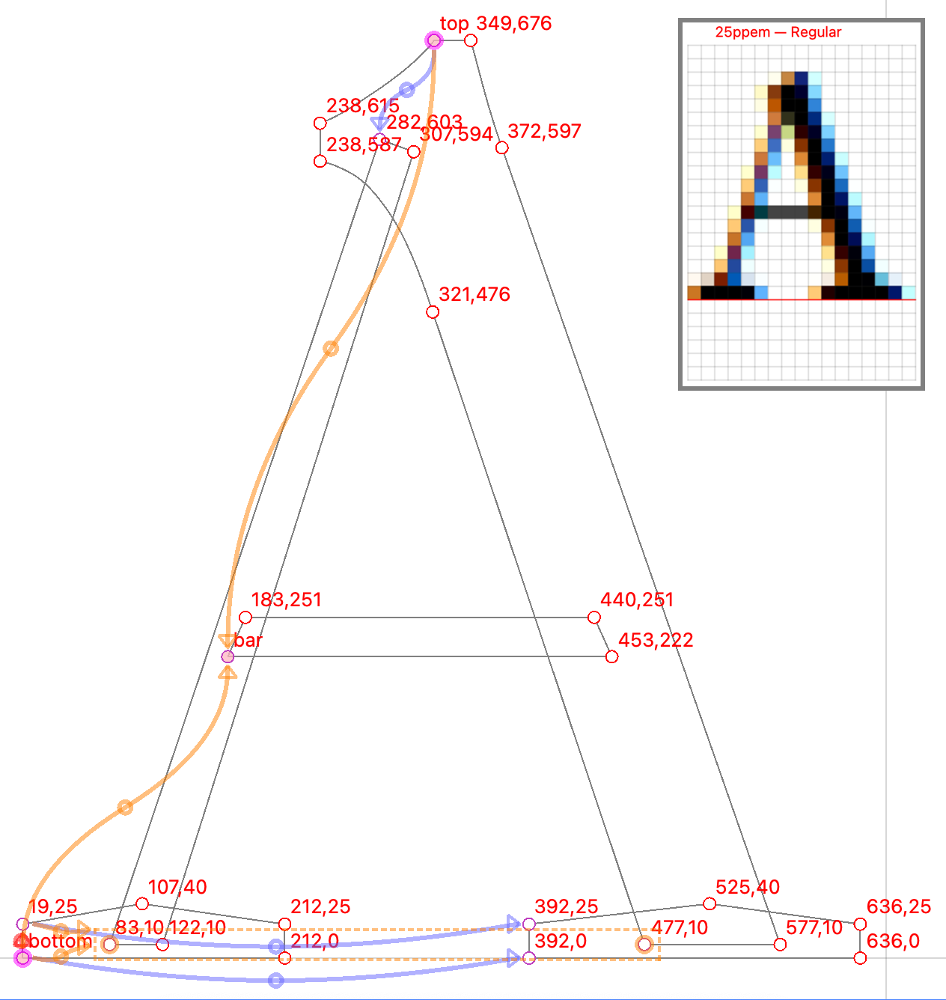

The last thing we need to do is regulate the top of the bar. We’ll need an unrounded stem hint with no CV—the kind we used for the serif. In fact, almost all the stems in this font will be regulated in the same way, with unrounded hints. So rather than unrounding every stem hint after we add it, lets change the default behavior of these stems. To do this, bring up the “Font Info” box and click over to the “Rounding” pane of the “Defaults” tab:

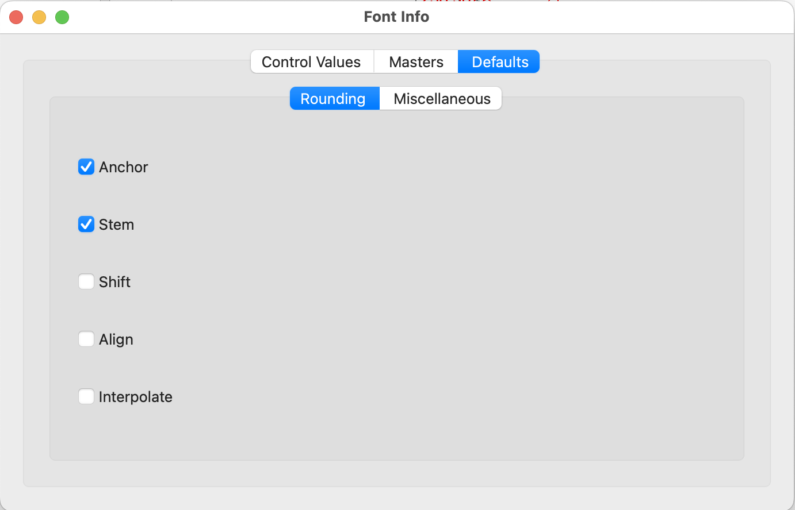

Uncheck the “Stem” box to make sure that every stem hint is unrounded when first added (you can always change a hint’s rounding later). Now return to the graphical editor and add a stem hint from “bar” to point 183,251:

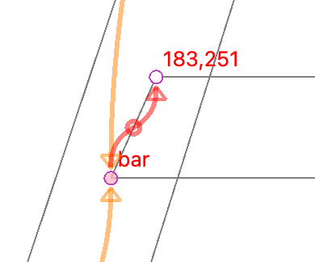

The bottom of the bar will appear sharp, being rounded to the grid, and the top will be anti-aliased—an effect that you can see more clearly (for both the bar and the serifs) at higher resolutions:

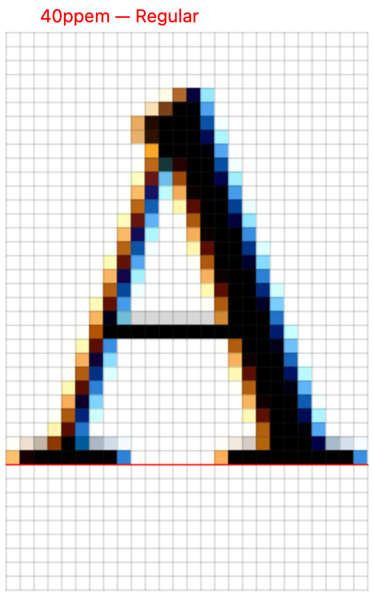

Saving your work
----------------

I’m going to hint one more glyph, but before we do that, let’s save our work. To do so, simply type **Ctrl-S** or **Cmd-S**, as in other applications. If you started your project by opening a TrueType font, ygt will save your work in a separate file with the same name as the font you opened, but with the suffix .yaml instead of .ttf. If you started by opening a UFO, your work will be saved in the UFO as /data/org.ygthinter/source.yaml (if you want to change from UFO to .ttf mode, simply copy this file out of the UFO, rename it, and edit the first line to point to a TrueType font). When you return to the project, open up the .yaml file, not the .ttf; or simply open the UFO again.

The letter i
------------

I’ll conclude the tutorial by walking you through hinting the letter i. The main part of the character (the “base”) is easy, given what you’ve learned so far:

*   Anchor point 0 to the baseline by selecting and typing **Ctrl-A**.
*   Add point 1 to the selection and type **T** to regulate the thickness of the serif.
*   Select points 1 and 18 and type **H** to regulate the right side of the serif.
*   Select point 11 and type **Ctrl-A** to hint the top of the minim.
*   Add point 10 to the selection and type **T**; then right-click on the hint and select “Minimum distance” from the context menu, unchecking it. This will position the left side of the beak.
*   Select points 9 and 10 and type **T** to keep the beak from disappearing at low resolutions.

Here is the result:

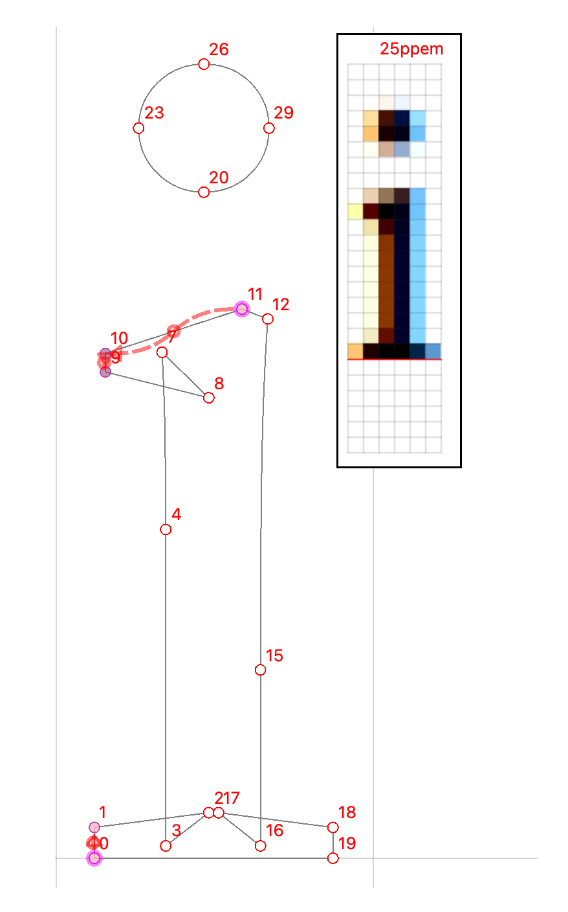

All that’s left now is the dot. The complication is that on the Optical Size axis of this variable font, the xheight varies—high at the minimum value and low at the maximum—and the height of diacritics (like the dot of the i) varies with it. Yet it is important to assign a CV for diacritics, since they vary in height (for example, an acute sits significantly lower than a macron) in a way that might look bad at low resolutions. For the base value of this CV, we should choose a position about halfway between the highest diacritic in the font (the macron, at 556) and the lowest (the acute at 521).

When creating a CV, it is best, whenever possible, to base it on an existing point rather than type a number in the “val” box.\*\*Basing a CV on an existing point allows ygt to determine the values of variant CVs. When we search through the font’s collection of diacritics for a suitable point, we find the combining breve (uni0306), whose lowest point, at 541, is almost exactly what we want. Navigate to this glyph in ygt, select the lowest on-curve point, type **C**, and enter the name “diacritic-height” for the new CV:

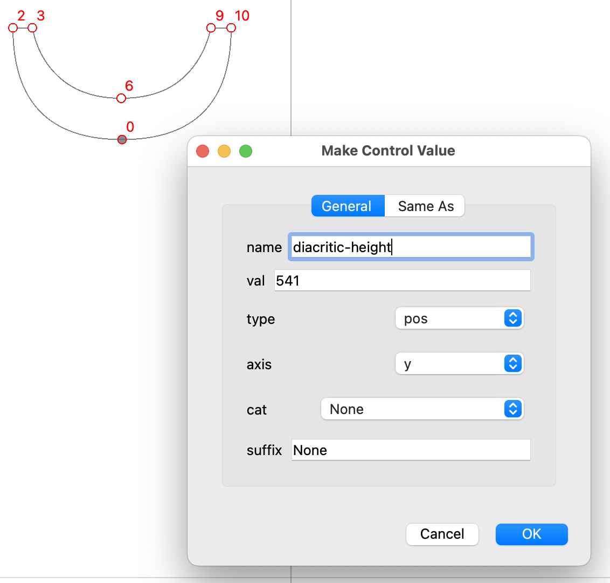

Now bring up the “Font Info” window, click over to the “Masters” tab, and click the “Generate Variant Control Values” button. A busy icon will appear for a few seconds. When it disappears, click over to the “Control Values” tab, double-click “diacritic-height” in the list of CVs, and then click over to the “Variants” pane:

As you can see, values have been added for the “opsz-min” and “opsz-max” masters (you can check these values in a font editor, but I promise that ygt has gotten them right). Masters with the value "None" will use the default value of 541.

Now return to the letter i, select the bottommost point in the dot, and type **Ctrl-A**. As you can see in the code pane, an anchor hint with CV “diacritic-height” has been added. Add the topmost point of the dot to the selection, type **T**, and we’re done with the letter i!

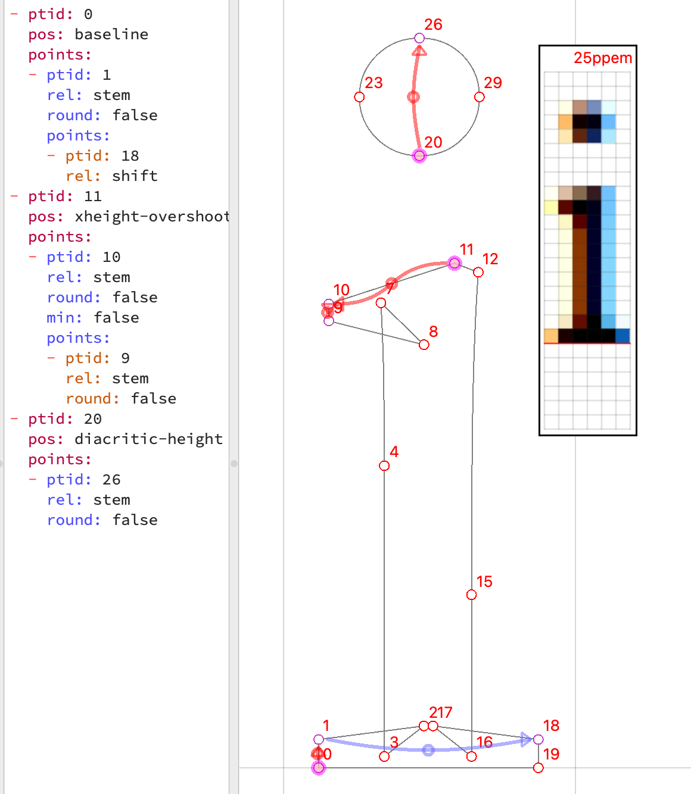

For further information, consult the document [YGT-Intro.pdf](https://github.com/psb1558/ygt/tree/main/docs) in the ygt [repository](https://github.com/psb1558/ygt).

ygt and this tutorial copyright © 2024–2025 by Peter S. Baker.
