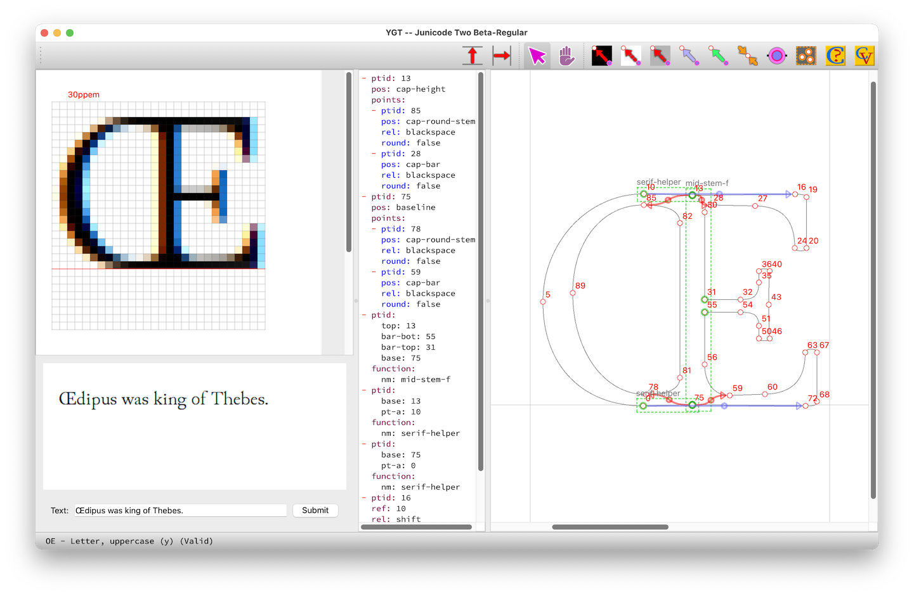
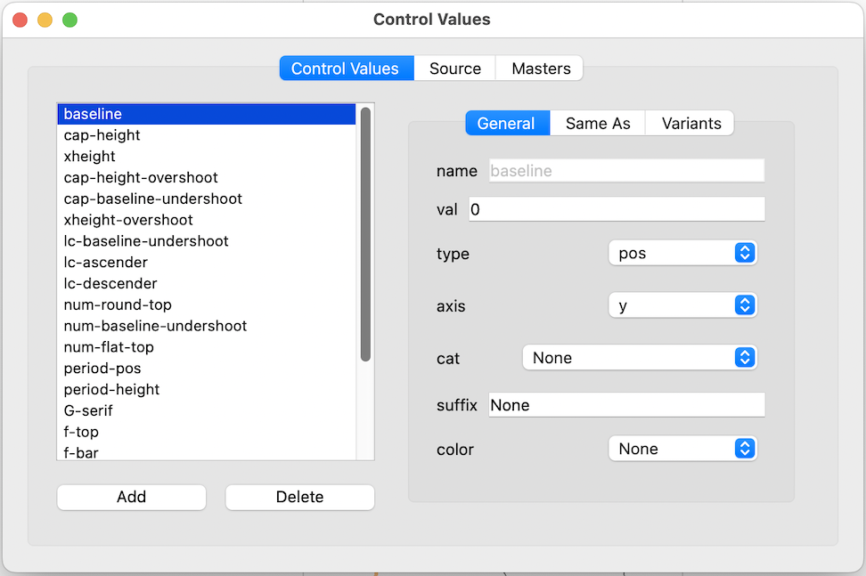

# Ygt

**New**: A [video introduction to ygt](https://psb1558.github.io/ygt/index.html).

**Ygt** is a cross-platform graphical program for hinting TrueType fonts. There are already several hinting tools for TrueType: the hinter built into Glyphs; the one built into FontLab; VTT (Visual TrueType), a stand-alone editor from Microsoft; and probably several more. These are all very good, but all have disadvantages. The Glyphs editor won't work for you unless you have purchased Glyphs and use that program to export fonts (if you use glyphsLib/fontmake, you're out of luck); in addition, Glyphs only runs on the Mac. I know little about the FontLab hint editor, but (obviously) you must purchase FontLab to get access to it. VTT is a sophisticated tool, and it is free, but its GUI is awkward and old fashioned. It is built on top of a poorly documented language called VTT Talk, and it runs only on Microsoft Windows. The program is rather a busybody (in my experience, anyway), repositioning the components of composite glyphs and thereby sometimes doing considerable damage (which, because of the scanty documentation, can be hard to undo).

Ygt is a cross-platform program, written in Python. It is entirely Libre/Open Source, and it doesn't depend on any font editor (all of its dependencies are also free). It is less sophisticated than some existing tools, but in this respect it is well suited for the contemporary font scene, in which hinting does not need to be as complex as it formerly was. It is built for speed, with all of the most common actions on shortcut keys, so that you can work quickly with one hand on the mouse and the other on the keyboard. Hints are saved in an easily edited YAML file.

Other hinting programs dump a large number of functions into your font. Ygt dumps only a few, but it encourages you to write your own functions and macros, and it provides a graphical interface for managing them. Functions are named rather than numbered. Control values are also named, and points and sets of points can be named too. You select named items from context menus.

Ygt is in an alpha state, with features yet to be added and some (mostly minor) issues. Deficits and items on the to-do list:

- There is no auto-hinting (but when did you ever see an auto-hinted glyph that didn't require extra attention?).
- The preview pane cannot yet display the output of Windows DirectWrite. Instead it uses FreeType—but it uses several of FreeType’s rendering modes.
- Several routines are inefficient, or just poorly written. I am not a professional programmer, but I am trying to produce legible and well-organized code.

That said, I have used Ygt to hint over 5000 glyphs in four large fonts, sometimes hinting nearly 100 glyphs in an hour. The code Ygt produces is compact: the hints for ca. 2000 glyphs add about 73k to the size of a 2.2MB font.

The screenshot below illustrates the use of functions (green boxes), primary moves of single points (red arrows), and subsidiary moves or shifts (blue arrows). In addition to the large editing pane, it shows the editable YAML source (in the center) and the preview pane (on the left), with a large preview of the current glyph
and either the current glyph in an array of sizes or a short sample text.



You will generally want to keep the font view window open alongside the main window:


In this window, glyphs that are already hinted are highlighted in blue, and you can navigate to any glyph by clicking on its image. Another window lets you edit the Control Value Table:



When you first open a font, Ygt generates a small collection of control values and (for variable fonts) masters and variant values for the cvar table. Here you can edit and add to Ygt’s collection of control values.

In due course, similar windows will be available for editing other aspects of the font: for now, Ygt offers an interface for editing its source code directly: all editing windows are validated, making it hard to go badly wrong, and the simple file format used by Ygt is documented in the file [YGT-intro.pdf](docs/YGT-intro.pdf).

Ygt must be installed and run from the command line. Download the zip file (the project is not yet on PyPi), unzip, make sure you're in an environment where Python 3.10 or higher is available, navigate to the directory with the file `pyproject.toml`, and type:
```
pip install .
```
After pip has installed Ygt and its dependencies, type `ygt` at the command line to launch the program. Open a TrueType font to get started. When you save (as you often should, since Ygt is new and in development), your work will be stored not in the font file, but in a file with the same name as the font and the extension `.yaml`. Open this and not the font the next time you run Ygt.